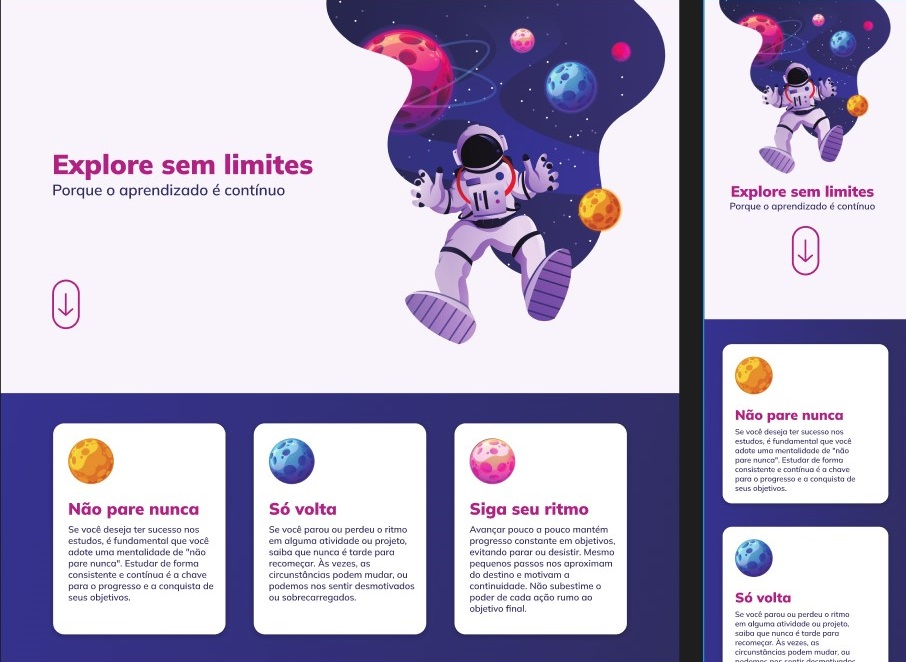

<h1 align="center">EXPLORE SEM LIMITES</h1>

  

    Desafio - Explore sem limites

  <a href="https://rafael-malaquias.github.io/Explore-sem-limites/">Projeto</a>&nbsp;&nbsp;&nbsp;|&nbsp;&nbsp;&nbsp;
  <a href="https://www.figma.com/file/tuoG8KYZWt17yMXQepD8Qk/Explore-sem-limites-(Copy)?type=design&node-id=2-10958&mode=design&t=6k0IWJOurHOwxGPO-0">Layout</a>&nbsp;&nbsp;&nbsp;|&nbsp;&nbsp;&nbsp;
  <a href="#memo-licença">Licença</a>

  

